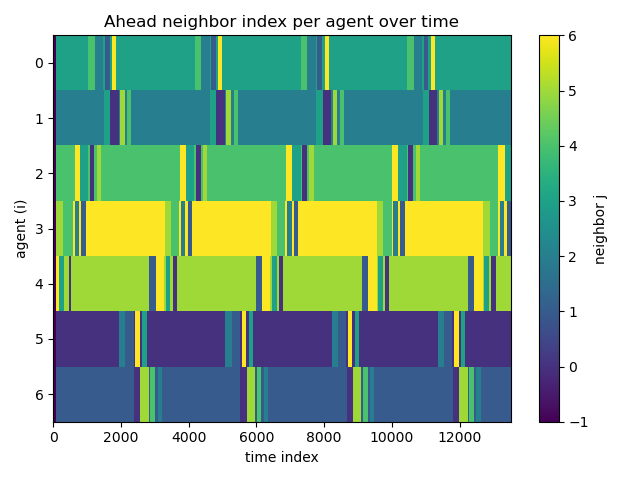
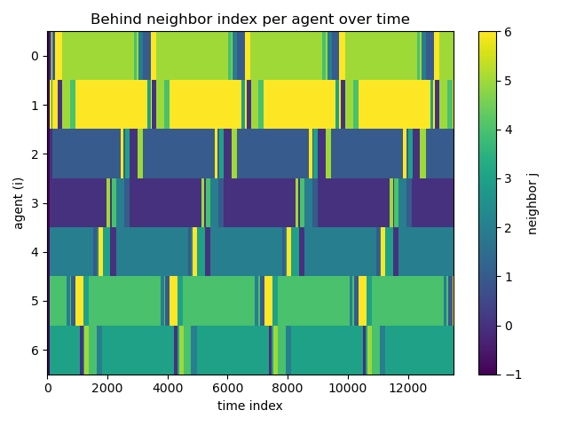
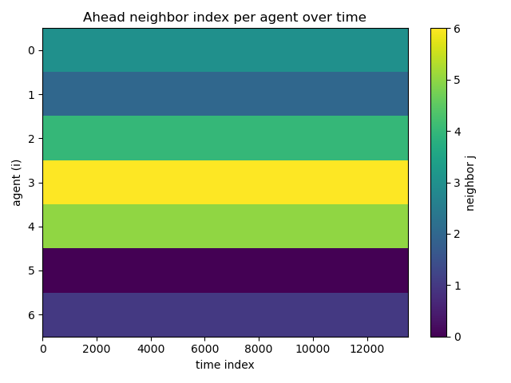
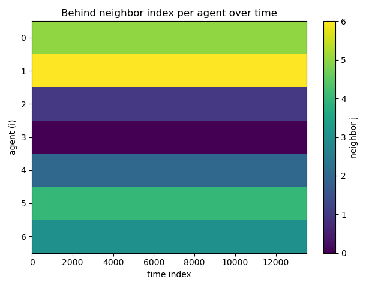

# Finding Neighbours in Busy Trajectories

This program implements an algorithm for finding consistent neighbouring agents in busy trajectories, such as *Emergent Homeomorphic Curves in Swarms* [(Jardine et al., 2025)](https://www.sciencedirect.com/science/article/abs/pii/S000510982500113X?via%3Dihub). In such scenarios, agents produce complex, emergent trajectories while relying on local information only. For example, for the Lemniscatic Arc shown in Figure 1, each agent regulates its position based on the relative positions of those immediately ahead of and behind them.

<figure style="text-align:center;">
  
  <figcaption><b>Figure 1:</b> Lemniscatic Arc of 7 Agents</figcaption>
</figure>

## Methodology

Our approach relies on a weighted score of consistency, persistence, and variability of the relative distance between agents over a time window. We define position and velocity vectors for each agent $i$ at timestep $t$:

$\mathbf{p}_i(t) = 
\begin{bmatrix} x_i(t) \\ y_i(t) \\ z_i(t) \end{bmatrix}$, 
$\mathbf{v}_i(t) =
\begin{bmatrix} \dot{x}_i(t) \\ \dot{y}_i(t) \\ \dot{z}_i(t) \end{bmatrix}$

and the unit velocity direction:

$\hat{\mathbf{u}}_i(t) = \frac{\mathbf{v}_i(t)}{\|\mathbf{v}_i(t)\| + \varepsilon}$

 We compute the relative distance matrix:

$\mathbf{D}_{ij}(t) = \mathbf{p}_j(t) - \mathbf{p}_i(t)$

The offset matrix measures how far each neighbouring agent lies along the forward or backward direction of motion:

$O_{ij}(t) = \mathbf{D}_{ij}(t) \cdot \hat{\mathbf{u}}_i(t)$

That is, the distance from agent $i$ to agent $j$ projected onto $i$’s heading direction. We then compute a score for each neighbour (within the prescribed window) based on the consistency, persistence, and variability of this offset over time. We select the highest scoring neighbours as the true ahead or behind agents.

## Results

Figure 2 show the results for a tight, sliding window of 100 timesteps. Here we see consistency across most of the dataset, with some confusion around the intersection at the center of the swarm. 

<figure style="text-align:center;">
  
  
  <figcaption><b>Figure 2:</b> Sliding Window</figcaption>
</figure>

This confusion is resolved when a fixed window is used across the entire dataset. This demonstrates the effectiveness of our approach in identifying true neighbouring agents in complex trajectories.

<figure style="text-align:center;">
  
  
  <figcaption><b>Figure 3:</b> Fixed Window</figcaption>
</figure>

